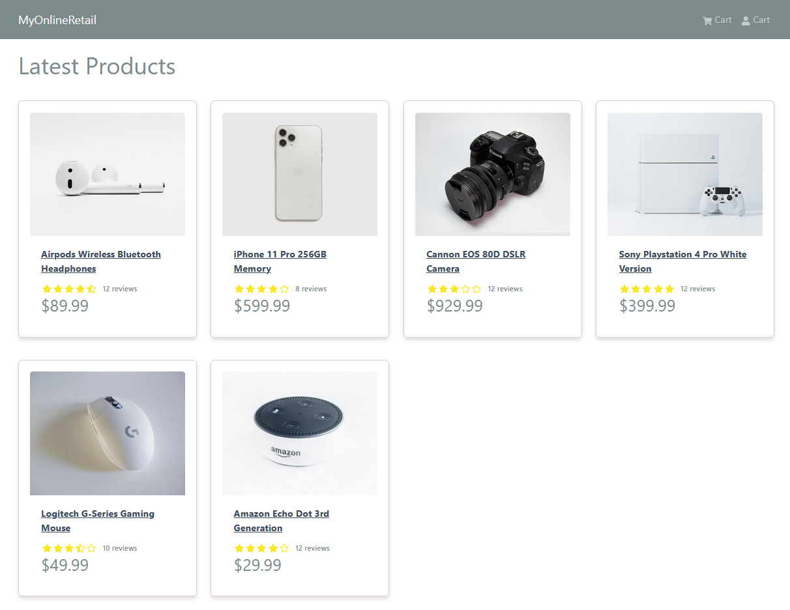
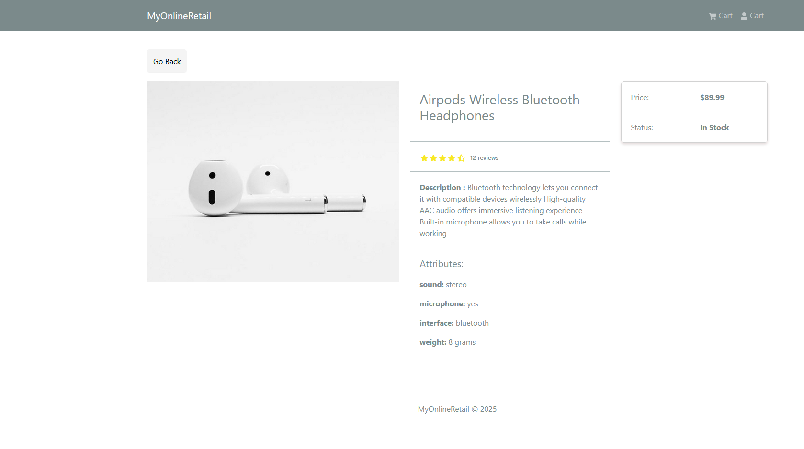

# MongoDB_ECommerce

[,console]
----
git clone https://github.com/bguedes/MongoDB_ECommerce.git

cd backend
npm install

cd ../frontend
npm install

cd ..
npm run dev

[0] 
[0] > myonlineretail@1.0.0 server
[0] > nodemon backend/server.js
[0] 
[1] 
[1] > frontend@0.0.0 dev
[1] > vite
[1]
[0] [nodemon] 3.1.9
[0] [nodemon] to restart at any time, enter `rs`
[0] [nodemon] watching path(s): *.*
[0] [nodemon] watching extensions: js,mjs,cjs,json
[0] [nodemon] starting `node backend/server.js`
[1] 
[1]   VITE v6.2.6  ready in 215 ms
[1]
[1]   ➜  Local:   http://localhost:8080/
[1]   ➜  Network: use --host to expose
[0] Server running on port 8000
[0] MongoDB Connected: ac-j7p8rqq-shard-00-01.inog7xy.mongodb.net
----

After you can load the UI using http://localhost:8080/, you will get this home page:

In Compass show this Text to MQL generation:

from products collection
get product that get price superior of 100
get product that get price superior of 100 and get ratings superior to 4

from orders collection
join orders and products
